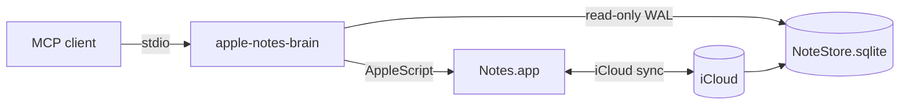

# apple-notes-brain

<!-- mcp-name: io.github.sweir1/apple-notes-brain -->

[](https://pypi.org/project/apple-notes-brain/)
[](https://opensource.org/licenses/Apache-2.0)
[](https://www.python.org/downloads/)
[](https://www.apple.com/macos/)

A local [Model Context Protocol](https://modelcontextprotocol.io/) server for Apple Notes on macOS. Gives Claude (or any MCP client) read, write, and search access to your notes — including searching **inside** note bodies, nested-folder scoping, full Markdown fidelity on reads, Markdown input on writes, and a set of ergonomics aimed at minimising token use and avoiding follow-up tool calls.

**📚 Full documentation: <https://sweir1.github.io/apple-notes-brain/>**

> Part of the `-brain` family of MCP servers. Sibling project: [`obsidian-brain`](https://github.com/sweir1/obsidian-brain) — same idea for Obsidian vaults.

## Why apple-notes-brain

- **Native Apple Notes.** Reads the on-disk SQLite store; writes via AppleScript. No iCloud round-trip, no scraping, no plugin.
- **Markdown round-trip.** Bidirectional HTML ↔ Markdown that preserves headings, lists, checklists, tables, and inline formatting. Apple's HTML dialect on the way in (`<b>`, `<ul class="checklist">`, etc.).
- **Semantic + hybrid search** (optional). ONNX/Ollama embeddings + RRF fusion with FTS5 for natural-language queries.
- **Stays on your Mac.** Stdio MCP transport. No telemetry, no cloud calls, notes never leave the machine.
- **Cursor pagination + short IDs** so an LLM can walk a 10k-note vault without blowing context.
- **Locked-note safe.** Encrypted bodies never decrypted; matched by title only; clear errors on write/delete attempts.

## Quick start

The one-liner installer wires up Claude Desktop, sorts out Full Disk Access for both the app and the `uvx` launcher, and walks you through the Automation permission. Idempotent — re-run any time.

```bash
/bin/bash -c "$(curl -fsSL https://raw.githubusercontent.com/sweir1/apple-notes-brain/main/scripts/install.sh)"
```

Manual install:

```bash
uvx apple-notes-brain                   # ephemeral (no install)
uv tool install apple-notes-brain       # global, managed by uv
pip install apple-notes-brain           # classic
```

Then point your MCP client at it. For Claude Desktop, edit `~/Library/Application Support/Claude/claude_desktop_config.json`:

```json
{
  "mcpServers": {
    "apple-notes-brain": {
      "command": "uvx",
      "args": ["apple-notes-brain"]
    }
  }
}
```

For everything else (Cursor, Claude Code, Continue, etc.) see [install in your MCP client](https://sweir1.github.io/apple-notes-brain/install-clients/).

## What you get

15 MCP tools: 11 lexical CRUD (`list_folders`, `list_notes`, `search_notes`, `get_note`, `get_notes`, `create_note`, `update_note`, `rename_note`, `move_note`, `create_folder`, `delete_note`) plus 4 optional semantic tools (`semantic_search`, `hybrid_search`, `reindex_semantic`, `semantic_index_status`) behind the `[semantic]` install extra.

Full reference: [docs.tools](https://sweir1.github.io/apple-notes-brain/tools/).

## How it works



Read/write split is deliberate: reads go through SQLite for sub-100ms p99 + concurrency with Notes.app's own writes; writes go through AppleScript because it's the only Apple API that preserves iCloud sync. See [architecture](https://sweir1.github.io/apple-notes-brain/architecture/) for the full picture.

## Troubleshooting

- **Empty results from every read tool** → Full Disk Access isn't set on `uvx`. See [troubleshooting → Full Disk Access](https://sweir1.github.io/apple-notes-brain/troubleshooting/#full-disk-access).
- **Tools hang for 60 seconds** → the Automation permission dialog was missed. [Fix](https://sweir1.github.io/apple-notes-brain/troubleshooting/#automation-permission).
- **`update_note` refused with "attachments would be destroyed"** → that's the [Apple attachment-destructive-write bug](https://sweir1.github.io/apple-notes-brain/architecture/#attachment-destructive-writes). Override with `allow_attachment_loss=True` only after explicit user confirmation.
- **Semantic tools return `missing-extras`** → install with `pip install 'apple-notes-brain[semantic]'`.

## Recent releases

<!-- GENERATED:recent-releases — DO NOT EDIT. Update docs/CHANGELOG.md, then run `python scripts/gen_readme_recent.py`. -->
- **v1.1.0** (2026-05-19) — Semantic search + HF metadata resolver chain
- **v1.0.3** (2026-04-21) — First PyPI publish
<!-- /GENERATED:recent-releases -->

See the [full changelog](https://sweir1.github.io/apple-notes-brain/CHANGELOG/) for everything else.

## Credits

Built on the official [MCP Python SDK](https://github.com/modelcontextprotocol/python-sdk) (provides the `FastMCP` class at `mcp.server.fastmcp`). Embedding subsystem uses [`onnxruntime`](https://onnxruntime.ai/), [`tokenizers`](https://github.com/huggingface/tokenizers), and [`sqlite-vec`](https://github.com/asg017/sqlite-vec). Markdown round-trip uses [`markdownify`](https://github.com/matthewwithanm/python-markdownify) + [`markdown`](https://github.com/Python-Markdown/markdown). Apple Notes protobuf schema vendored from community sources (MIT).

## Related projects

- [`obsidian-brain`](https://github.com/sweir1/obsidian-brain) — sibling MCP server for Obsidian vaults: semantic search, knowledge graph, vault editing.
- [`modelcontextprotocol/python-sdk`](https://github.com/modelcontextprotocol/python-sdk) — the official MCP Python SDK.

## License

[Apache License 2.0](./LICENSE) — Copyright 2026 sweir1.
