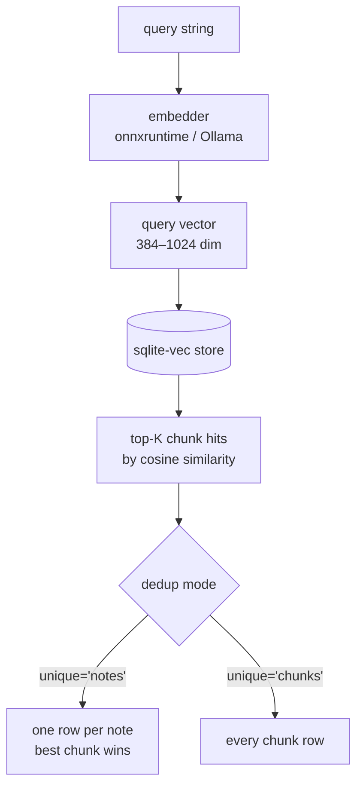

# How embeddings work

apple-notes-brain ships a semantic search subsystem (`semantic_search`, `hybrid_search`, `reindex_semantic`, `semantic_index_status`) gated behind the `[semantic]` install extra. Without the extra installed, those four tools return a structured `{"error": "...", "code": "missing-extras"}` envelope and the rest of the server is unaffected.

## Install

```bash
pip install 'apple-notes-brain[semantic]'
# or, with uv
uv add 'apple-notes-brain[semantic]'
```

After the first call, the embedder downloads `BAAI/bge-small-en-v1.5` (ONNX-quantised, ~30MB) into `~/.local/share/apple-notes-brain/models/` and runs in-process via onnxruntime. On Apple Silicon, the `CoreMLExecutionProvider` is preferred — verify via `semantic_index_status()`.

## Why direct ONNX (not fastembed, not sentence-transformers)

- **fastembed** has open Apple Silicon performance issues ([qdrant/fastembed#535](https://github.com/qdrant/fastembed/issues/535), [#97](https://github.com/qdrant/fastembed/issues/97)) — its CPU fallback would be a regression on the macOS-only target. apple-notes-brain uses `onnxruntime` + `tokenizers` + `huggingface-hub` directly so the CoreML execution provider lights up on M-series Macs.
- **sentence-transformers** even with the `[onnx]` extra still installs PyTorch (~600MB). The direct-ONNX path stays at ~80MB total install.

## How a search works



Chunking happens at indexing time: notes are split into token-aware chunks sized to the active model's context window. The chunker handles checklists, code blocks, and tables without splitting mid-element.

## Hybrid search (RRF)

`hybrid_search` runs `semantic_search` and `search_notes` in parallel, then fuses the two ranked lists with **Reciprocal Rank Fusion** (`k=60`, the standard constant). Each returned hit carries both a `semantic_score` and a `lexical_score` so you can see where the relevance came from. Recall is consistently higher than either tool alone on the test vault.

## Ollama instead of in-process ONNX

Set `EMBEDDING_PROVIDER=ollama`. Optional knobs:

- `OLLAMA_BASE_URL` (default `http://localhost:11434`)
- `EMBEDDING_MODEL` (e.g. `qwen3-embedding:0.6b`, `nomic-embed-text`)
- `OLLAMA_NUM_CTX` to override the context window
- `APPLE_NOTES_BRAIN_OLLAMA_AUTO_PULL=0` to disable auto-pull on first call

When provider and preset conflict, **provider wins** and a one-shot warning is emitted to stderr.

## When to reindex

You usually don't need to — `reindex_semantic` is content-hash-deduped, the background watcher catches changes within `APPLE_NOTES_BRAIN_INDEX_INTERVAL` seconds (default 30), and the index survives across restarts.

Reindex manually when:

- You switch `EMBEDDING_PRESET` or `EMBEDDING_MODEL` (the model dim or tokeniser changed → all old vectors are stale).
- You want to verify the index is healthy: `reindex_semantic(force=True)` followed by `semantic_index_status()` — the counters should match your note count.
- A failed-chunks count keeps creeping up. The `failures` list returned by `reindex_semantic` is capped at 50 entries so you can see what broke without flooding the response.

## Bring your own model (BYOM)

`EMBEDDING_MODEL` accepts any HF repo that publishes an ONNX export and an accompanying `tokenizer.json`. The metadata resolver chain (`semantic/hf_metadata.py` → `semantic/metadata_resolver.py`) reads the model's `config.json` for the output dimension, then verifies it matches `EMBEDDING_DIM` if you set one. Mismatched dim → hard error, no silent reindex with the wrong vectors.

If a model isn't in the bundled `seed-models.json`, the resolver falls back to the live HuggingFace API at first launch and caches the result under `<data_dir>/models/metadata-cache.json`.
